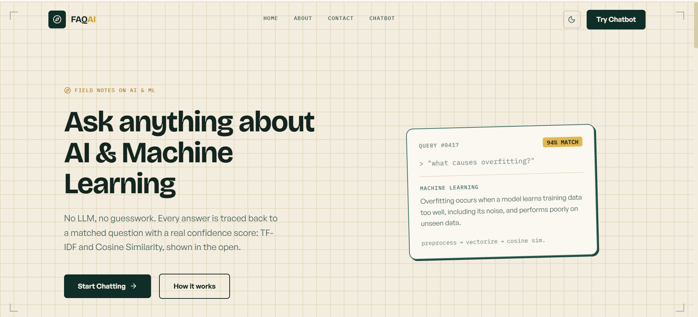
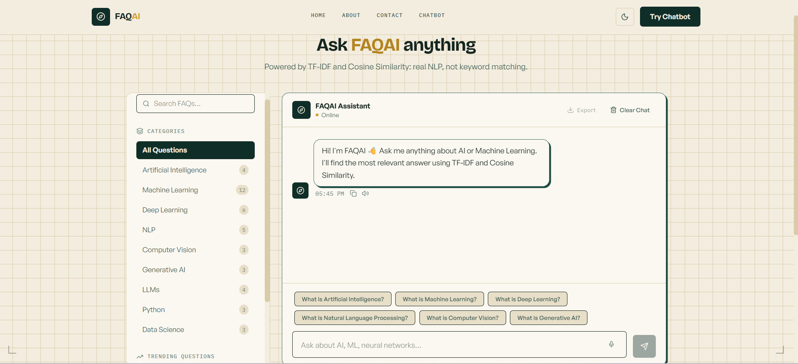
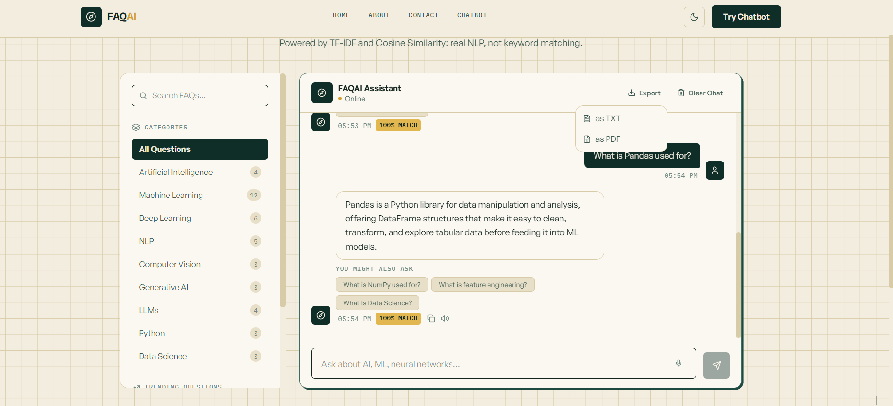

<div align="center">

# FAQAI
### AI & Machine Learning FAQ Chatbot

**An NLP-powered chatbot that understands natural-language questions using TF-IDF vectorization and Cosine Similarity — no keyword matching, no hardcoded rules, no LLM API calls.**

Built as a personal learning project.

[](https://www.python.org/)
[](https://fastapi.tiangolo.com/)
[](https://react.dev/)
[](https://tailwindcss.com/)
[](https://scikit-learn.org/)
[](https://www.nltk.org/)

</div>

---

> Ask a question in your own words → the backend preprocesses it with NLTK, vectorizes it with Scikit-learn's TF-IDF, and returns the most similar FAQ answer along with a confidence score.

## Table of Contents

- [Screenshots](#-screenshots)
- [Features](#-features)
- [Tech Stack](#-tech-stack)
- [Project Structure](#-project-structure)
- [Getting Started](#-getting-started)
- [API Reference](#-api-reference)
- [Environment Variables](#%EF%B8%8F-environment-variables)
- [How the Matching Works](#-how-the-matching-works)
- [Deployment](#%EF%B8%8F-deployment)
- [Documentation](#-documentation)
- [Acknowledgments](#-acknowledgments)

---

## 📸 Screenshots

<table>
<tr>
<td width="50%"></td>
<td width="50%"></td>
</tr>
<tr>
<td align="center"><sub>Landing page</sub></td>
<td align="center"><sub>Chatbot — welcome state</sub></td>
</tr>
</table>

<p align="center">

<br><sub>Chatbot — active conversation with live confidence scores</sub>
</p>

---

## ✨ Features

**Core (internship requirements)**

| | |
|---|---|
| ✅ | FAQ collection stored in JSON — not hardcoded in source |
| ✅ | Full NLP preprocessing pipeline: lowercasing → tokenization → punctuation removal → stopword removal → stemming (NLTK, PorterStemmer) |
| ✅ | TF-IDF vectorization + Cosine Similarity matching (Scikit-learn) |
| ✅ | Smart fallback — never guesses an answer when confidence is too low |
| ✅ | Clean, fully responsive chat interface (React + Tailwind CSS) |

**Extras**

| | | | |
|---|---|---|---|
| 🌗 Dark / light mode | 📂 Category sidebar (9 categories, 43 FAQs) | 🔥 Trending questions | 💬 Session-persisted history |
| 🎤 Voice input (STT) | 🔊 Text-to-Speech answers | 📋 Copy-to-clipboard | 📄 Export chat (TXT / PDF) |
| 🔍 Keyword search | ⭐ Bookmark / favorite FAQs | 📊 Confidence score per answer | 🔗 Related follow-up questions |

**Reliability & Testing**

| | |
|---|---|
| ✅ | Evaluation suite (43 paraphrased + 8 out-of-domain test queries) — **86.0% core matching accuracy, 100% out-of-domain precision** |
| ✅ | Rate limiting (20 requests/min per IP) on the chat endpoint |
| ✅ | Structured request logging + lightweight in-memory usage metrics (`/api/stats`) |

---

## 🛠 Tech Stack

| Layer | Technology |
|---|---|
| **Frontend** | React 19, Vite, Tailwind CSS v4, Framer Motion, Axios, React Router |
| **Backend** | Python, FastAPI, Uvicorn |
| **NLP** | NLTK (tokenization, stopwords, stemming) |
| **ML** | Scikit-learn (TF-IDF Vectorizer, Cosine Similarity) |
| **Data** | JSON (FAQ store) |
| **PDF Export** | jsPDF |

---

## 📁 Project Structure

```
AI-ML FAQ Chatbot/
├── backend/
│   ├── app/
│   │   ├── main.py                 # FastAPI app entrypoint, CORS setup
│   │   ├── config.py               # Environment-based settings
│   │   ├── models.py               # Pydantic request/response schemas
│   │   ├── data/
│   │   │   └── faqs.json           # 43 FAQs across 9 categories
│   │   ├── nlp/
│   │   │   ├── preprocessing.py    # NLTK text preprocessing pipeline
│   │   │   └── matcher.py          # TF-IDF + Cosine Similarity engine
│   │   ├── services/
│   │   │   └── faq_service.py      # Business logic: loading, filtering, matching
│   │   └── routers/
│   │       └── chat.py             # API routes
│   ├── requirements.txt
│   └── .env.example
│
├── frontend/
│   ├── src/
│   │   ├── components/             # Navbar, Hero, ChatWindow, ChatBubble, etc.
│   │   ├── pages/                  # Home.jsx, Chatbot.jsx
│   │   ├── hooks/                  # useChat.js, useBookmarks.js
│   │   ├── context/                # ThemeContext.jsx (dark/light mode)
│   │   ├── services/               # api.js (Axios client)
│   │   ├── utils/                  # exportChat.js (TXT/PDF export)
│   │   └── App.jsx
│   ├── package.json
│   └── .env.example
│
└── docs/
    └── screenshots/                # Project screenshots

## 🚀 Getting Started

### Prerequisites
- Python 3.10+
- Node.js 18+
- npm

### 1. Backend Setup

```bash
cd backend
python -m venv venv

# Activate the virtual environment
venv\Scripts\activate        # Windows
source venv/bin/activate     # macOS / Linux

pip install -r requirements.txt
cp .env.example .env         # Windows: copy .env.example .env

uvicorn app.main:app --reload --host 127.0.0.1 --port 8001
```

Backend runs at `http://127.0.0.1:8001` — interactive API docs at `http://127.0.0.1:8001/docs`.

### 2. Frontend Setup

Open a **second terminal**:

```bash
cd frontend
npm install
cp .env.example .env         # Windows: copy .env.example .env

npm run dev
```

For Windows PowerShell:

```powershell
cd frontend
npm install
Copy-Item .env.example .env
npm run dev
```

Frontend runs at `http://localhost:5173`.

> ⚠️ Both servers must be running simultaneously for the chatbot to work.

If your backend runs on a different host or port, update `frontend/.env`:

```env
VITE_API_BASE_URL=http://127.0.0.1:8001
```

---

## 🔌 API Reference

| Method | Endpoint | Description |
|---|---|---|
| `GET` | `/api/health` | Health check, returns FAQ count |
| `GET` | `/api/faqs` | All FAQs (optional `?category=` filter) |
| `GET` | `/api/faqs/categories` | Categories with FAQ counts |
| `GET` | `/api/faqs/popular` | Trending / popular FAQs |
| `GET` | `/api/faqs/suggested` | One suggested question per category |
| `GET` | `/api/stats` | Lightweight usage metrics (total queries, match rate, avg confidence) |
| `POST` | `/api/chat` | Send `{ "message": "..." }`, get matched answer + confidence + related questions. Rate limited to 20 requests/min per IP. |

<details>
<summary><strong>Example request / response</strong></summary>

**Request**
```bash
curl -X POST http://127.0.0.1:8001/api/chat \
  -H "Content-Type: application/json" \
  -d '{"message": "what is overfitting"}'
```

**Response**
```json
{
  "matched": true,
  "answer": "Overfitting occurs when a model learns the training data too well, including its noise and outliers, causing it to perform poorly on new, unseen data.",
  "question": "What is overfitting?",
  "category": "Machine Learning",
  "confidence": 1.0,
  "related_questions": [
    { "id": 12, "question": "How do you prevent overfitting?", "category": "Machine Learning" },
    { "id": 43, "question": "What is feature engineering?", "category": "Data Science" }
  ]
}
```
</details>

---

## ⚙️ Environment Variables

**`backend/.env`**
```env
ENV=development
ALLOWED_ORIGINS=http://localhost:5173
SIMILARITY_THRESHOLD=0.25
```

**`frontend/.env`**
```env
VITE_API_BASE_URL=http://127.0.0.1:8001
```

---

## 🧠 How the Matching Works

1. All FAQ questions are preprocessed once at startup and vectorized into a TF-IDF matrix.
2. An incoming user message goes through the same preprocessing pipeline (lowercase → tokenize → remove punctuation → remove stopwords → stem).
3. The processed query is vectorized using the same fitted TF-IDF vectorizer.
4. Cosine similarity is computed between the query vector and every FAQ vector.
5. The highest-scoring FAQ is returned **only if** its similarity clears the configured threshold (default `0.25`) — otherwise the chatbot responds with a fallback message instead of guessing.

---

## 🧪 Testing & Evaluation

The matching engine is validated with a dedicated evaluation script (`backend/tests/evaluate_matching.py`) covering 43 paraphrased queries (one per FAQ, not the literal stored question), 8 out-of-domain queries, and 4 known-limitation acronym cases:

```bash
cd backend
python -m tests.evaluate_matching
```

| Metric | Result |
|---|---|
| Core matching accuracy | **86.0%** (37/43 paraphrased queries matched correctly) |
| Out-of-domain precision | **100%** (8/8 irrelevant queries correctly rejected) |
| Avg query response time | ~0.7ms |

Two real preprocessing bugs were found and fixed using this suite (raising accuracy from 74.4% → 86.0%):
- **Hyphen handling** — punctuation was being *deleted* rather than replaced with a space, silently merging words like `semi-supervised` → `semisupervised`.
- **Lemmatization vs. stemming** — WordNet's lemmatizer doesn't recognize ML jargon like *"overfitting"* (it's a no-op), so `overfit` and `overfitting` never shared a token. Switching to `PorterStemmer` fixed this.

---

## ☁️ Deployment

| Service | Platform |
|---|---|
| Frontend | [Vercel](https://vercel.com) |
| Backend | [Render](https://render.com) |

Full step-by-step deployment instructions are included in [`FAQAI_Documentation.pdf`](FAQAI_Documentation.pdf).

---

## 📄 Documentation

A complete project write-up — architecture, NLP matching design, API reference, error handling, known limitations, and future improvements — is available in [`FAQAI_Documentation.pdf`](FAQAI_Documentation.pdf).

---

## 🙏 Acknowledgments

Built as a personal learning project — FAQ Chatbot.

<div align="center">
<sub>Made with TF-IDF, Cosine Similarity, and a lot of debugging 💜</sub>
</div>